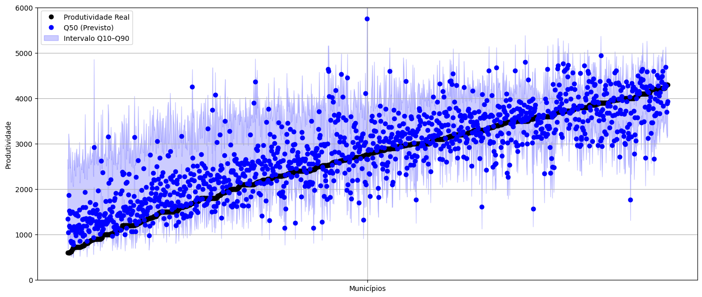
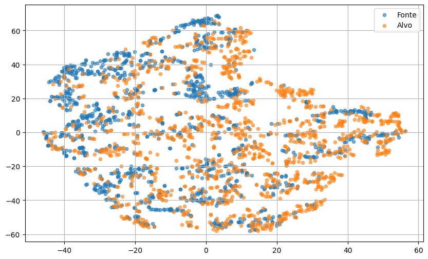
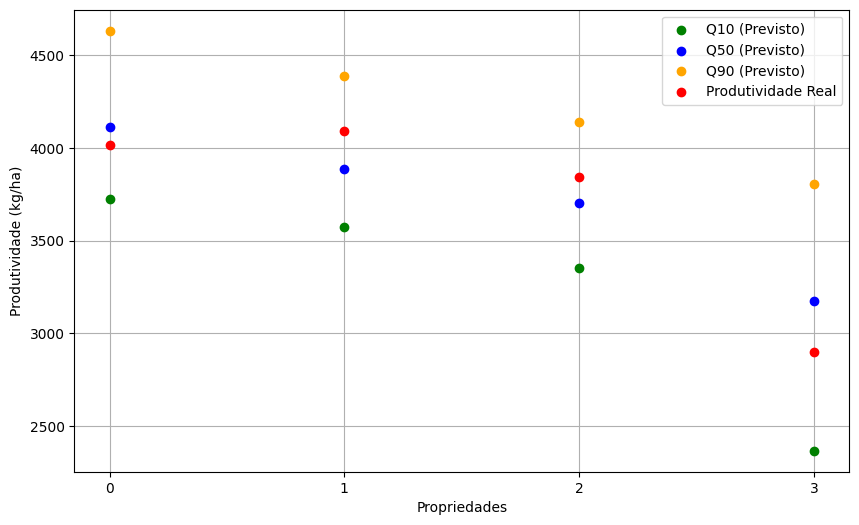

# Previsão de Produtividade de Soja Utilizando Adaptação de Domínio

## Introdução

Este projeto tem como objetivo desenvolver uma metodologia baseada em aprendizado profundo e adaptação de domínio para a previsão da produtividade da soja em propriedades rurais. A abordagem utiliza dados de sensoriamento remoto e variáveis climáticas para capturar padrões associados ao desenvolvimento da cultura, transferindo o conhecimento aprendido em escala municipal para o nível de propriedade. O modelo é capaz de estimar intervalos de produtividade, fornecendo os quantis Q10, Q50 e Q90, nos quais Q10 representa o cenário pessimista, Q50 a mediana e Q90 o cenário otimista, permitindo avaliar a incerteza das previsões. Dessa forma, busca-se superar a ausência de rótulos diretos em propriedades rurais e fornecer estimativas precisas e aplicáveis à agricultura de precisão, contribuindo para o planejamento e a tomada de decisão no setor agrícola.

  

## Dataset

O modelo é composto por dois conjuntos de dados: um em nível municipal e outro em nível de propriedade. As *features* foram extraídas por meio do Google Earth Engine (GEE), enquanto as informações de produtividade em escala municipal foram obtidas a partir do Instituto Brasileiro de Geografia e Estatística (IBGE). Além disso, o *MapBiomas* foi utilizado como máscara de uso e cobertura do solo, garantindo que as *features* fossem capturadas apenas em áreas efetivamente cultivadas com soja.

### *Features* Utilizadas

As *features* utilizadas são:

* `Normalized Difference Vegetation Index (NDVI)`  (índice espectral que indica a densidade e a saúde da vegetação na área estudada.)
* `Normalized Difference Water Index (NDWI)`       (índice espectral relacionado ao conteúdo de água na vegetação e no solo na área estudada.)
* `Temperatura máxima`                             (média das temperaturas máximas registradas na área duranto período de estudo.)
* `Temperatura mínima`                             (média das temperaturas mínimas registradas na área duranto período de estudo.)
* `Precipitação`                                   (quantidade média de precipitação registrada na área.)
* `Radiação solar`                                 (quantidade de energia solar incidente sobre a área.)

### Extração a Nível Municipal

### Extração a Nível de Propriedade

## Resultados

    

Os resultados obtidos em nível municipal indicaram um erro médio de aproximadamente 400 kg/ha entre o quantil mediano (𝑄50) previsto e a produtividade real observada. Esse valor sugere que o modelo apresentou boa capacidade de generalização e convergência durante o treinamento

    

Os resultados indicam que a adaptação de domínio foi eficaz, pois o modelo conseguiu gerar vetores latentes invariantes entre os domínios municipal e de propriedade. Essa carac- terística permite que o modelo realize previsões em nível de propriedade com desempenho semelhante ao obtido em nível municipal.

    

Das quatro amostras disponíveis, observa-se que o modelo realizou previsões consistentes da produtividade, apresentando um erro médio de aproximadamente 200 kg/ha entre o quantil mediano (𝑄50) e a produtividade real. Este desempenho é ainda superior ao observado nas previsões em nível municipal, evidenciando a eficácia do modelo.

## Licença

Este projeto está licenciado sob a licença MIT - veja o arquivo LICENSE para detalhes.
